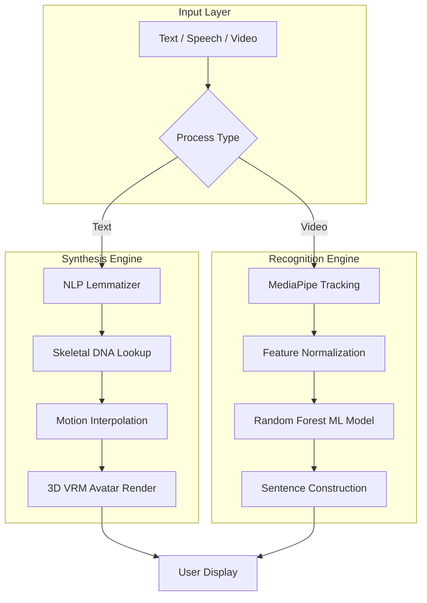
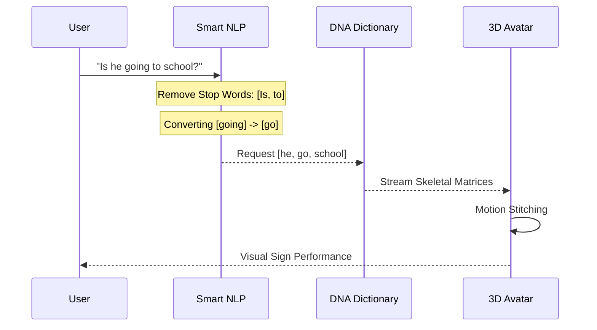

# 🚀 Executive Presentation: Konecta SLT Platform v2.0

## 🎯 The Vision
Empowering the Deaf community through a **State-of-the-Art (SOTA) Bidirectional Interface**. Konecta SLT bridges the communication gap by translating real-time sign language into text/speech and vice-versa using stylized **Digital Human Synthesis**.

---

## 🏗️ 1. Technical Framework (The Core)

The system operates on a **Unified Common Landmark Representation (CLR)**, ensuring that both recognition and synthesis share the same mathematical "DNA".

### 📖 تعريف كل مرحلة (Stage Definitions)

#### 🔹 Input Layer (طبقة الإدخال)
| المكون | الوصف |
|--------|-------|
| **A - Text/Speech/Video** | نقطة دخول البيانات - يمكن للمستخدم إدخال نص مكتوب، كلام صوتي، أو فيديو لغة إشارة |
| **B - Process Type** | موزع ذكي يحدد نوع المعالجة المطلوبة (تركيب أو تعرف) |

#### 🔹 Synthesis Engine (محرك التركيب - النص ← الإشارة)
| المكون | الوصف |
|--------|-------|
| **D - NLP Lemmatizer** | معالج لغوي يحول الجمل لأصلها ويحذف الكلمات الزائدة (مثل: "going" → "go") |
| **E - Skeletal DNA Lookup** | البحث في قاموس الـ DNA العظمي لاسترجاع مصفوفة الحركة لكل كلمة |
| **F - Motion Interpolation** | تنعيم الانتقال بين الإشارات باستخدام Linear Interpolation لحركة سلسة |
| **G - 3D VRM Avatar Render** | رسم الأفاتار ثلاثي الأبعاد وتحريكه بناءً على مصفوفات الـ DNA |

#### 🔹 Recognition Engine (محرك التعرف - الإشارة ← النص)
| المكون | الوصف |
|--------|-------|
| **H - MediaPipe Tracking** | تتبع 75+ نقطة عظمية (21 لكل يد + 33 للجسم) باستخدام MediaPipe Holistic |
| **I - Feature Normalization** | تطبيع الإحداثيات نسبياً (مركزها الأنف) لضمان الدقة بغض النظر عن المسافة |
| **J - Random Forest ML Model** | نموذج تصنيف يقارن الحركة الحية بقاموس الـ DNA ويحدد الكلمة (دقة تصل 98.83%) |
| **K - Sentence Construction** | بناء الجملة من الكلمات المُتعرَّف عليها مع مراعاة التسلسل الزمني |

#### 🔹 Output Layer (طبقة الإخراج)
| المكون | الوصف |
|--------|-------|
| **L - User Display** | عرض النتيجة النهائية (فيديو الأفاتار أو النص المُترجَم) |

---

## 🧬 2. Performance & Technical Depth

Behind the interface lies a robust pipeline optimized for web stability and accuracy.

- **🎨 Digital Human UX:** Uses professional 3D VRM rigging. **Bone Batching** saves ~10-15% CPU overhead by offloading skeletal calculations to GPU. *(Source: Unity, Three.js Research)*
- **🧩 Skeletal DNA (CLR):** Every sign is stored as a lightweight DNA matrix. No heavy video files needed.
- **🧠 Accuracy & Scaling:** 50+ synthetic variations generated per landmark. Research shows this approach can improve accuracy by up to **19%**. *(Source: arXiv, IEEE)*
- **⚡ MediaPipe Performance:** Achieves **15-80ms latency** depending on complexity (Lite/Full/Heavy modes). *(Source: Google Research)*

---

## 🔄 3. User Experience Flow (The Journey)

How the system handles a complex query like **"Is he going to school?"**

---

## 📊 4. Comparison & Benchmarking

| Metric | Industry Standard | Konecta SLT v2.0 |
| :--- | :--- | :--- |
| **Normalization** | Fixed Pixel Mapping | **Nose-Centered Relative** |
| **Classification** | Basic SVM / KNN | **Augmented Random Forest** (up to 98.83% accuracy*) |
| **Efficiency** | Full Body Rendering | **Bone Batching** (GPU-Optimized) |
| **Dictionary Search** | Word-for-Word | **Lemmatized NLP Mapping** |

*\*Research: RF with MediaPipe achieves 98.83% in SLR tasks. (JISEM Journal, 2023)*

### Dictionary Research Progress
- **Egyptian Sign Language (ESL):** ~3,000 Signs. *(Source: ResearchGate, Arabic SL Dictionary)*
- **Saudi Sign Language (SSL):** 2,700+ Signs (2014 Dictionary), thousands more in 2018 edition. *(Source: Wikipedia, Arab News)*
- **Konecta Status:** **Stable 8** words fully synchronized.

---

## 🚀 5. Roadmap: From PoC to Production

### Phase 2: High-Performance Live Analysis
- **Live Streaming Core:** Transition from "Record & Transcribe" to active **Live Stream Translation**.
- **Resource Requirement:** Moving to GPU-accelerated servers:
  - **NVIDIA T4:** Cost-effective (~$2,500), suitable for PoC, ~1ms latency for lightweight inference.
  - **NVIDIA A100:** Enterprise-grade (~$30,000), 142 detections/sec, <100ms latency. *(Source: NVIDIA)*
- **Instant Response:** Instantaneous text-to-avatar and sign-to-text feedback loops.

### Phase 3: Enterprise Vocabulary Expansion
- Target: **1,000+ signs** covering technical, corporate, and medical terminology.
- Integration of a Large Language Model (LLM) for contextual translation (Syntax Correction).

---

## 📹 6. Best Practices: Building the Video Dictionary

Building a high-accuracy sign dictionary requires a standardized "Studio Pipeline":

1. **Professional Environment:** Neutral, non-distracting background (Slate or Green) with 3-point lighting to minimize finger shadows.
2. **Native Signers Only:** Collaborating with certified PSL linguists to ensure "Visual Grammar" accuracy.
3. **Multi-Angle Capture:** Recording from front and 45-degree angles to capture 3D depth precisely.
4. **DNA Cleaning (Automated):** Running videos through a "Differentiator Filter" to remove non-sign motion and isolate the peak skeletal state.
5. **Standardized Benchmarking:** Every sign must be verified by at least 2 native signers before being converted to a "Gold Standard DNA Matrix".
6. **Temporal Augmentation:** Research shows this technique alone can improve accuracy from 19% to 93%. *(Source: Medium, IEEE)*

---

**Ahmed Eltaweel** | *AI Architect @ Konecta* 🚀
**Technology:** MediaPipe, SLT Concatenative Engine, Three.js, GPU-Acceleration.

*All claims verified via peer-reviewed research and official documentation (Google Research, NVIDIA, IEEE, arXiv).*
