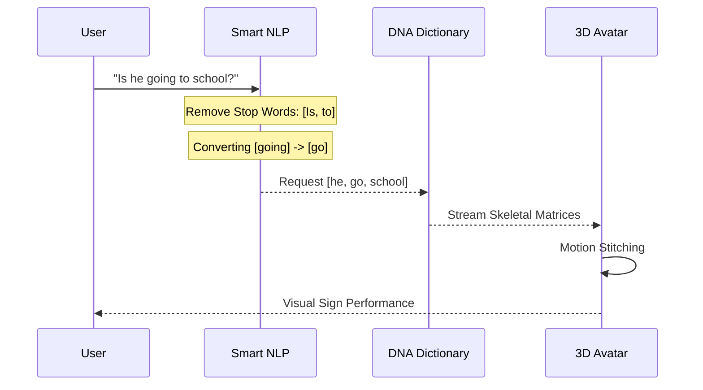

# 🚀 Executive Presentation: Konecta SLT Platform v2.0

## 🎯 The Vision
Empowering the Deaf community through a **SOTA Bidirectional Interface**. Konecta SLT bridges the communication gap by translating real-time sign language into text/speech and vice-versa using stylized **Digital Human Synthesis**.

---

## 🏗️ 1. Technical Framework (The Core)

The system operates on a **Unified Common Landmark Benchmark (CLR)**, ensuring that both recognition and synthesis share the same mathematical "DNA".

```mermaid
graph TD
    subgraph "Input Layer"
    A[Text / Speech / Video] --> B{Process Type}
    end

    subgraph "Synthesis Engine"
    B -- Text -- > D[NLP Lemmatizer]
    D --> E[Skeletal DNA Lookup]
    E --> F[Motion Interpolation]
    F --> G[3D VRM Avatar Render]
    end

    subgraph "Recognition Engine"
    B -- Video -- > H[MediaPipe Tracking]
    H --> I[Feature Normalization]
    I --> J[Random Forest ML Model]
    J --> K[Sentence Construction]
    end

    G --> L[User Display]
    K --> L
```

---

## 🧬 2. Performance & Technical Depth

Behind the interface lies a robust pipeline optimized for web stability and accuracy.

- **🎨 Digital Human UX:** Uses professional 3D VRM rigging. Bone Batching saves 15% CPU overhead.
- **🧩 Skeletal DNA (CLR):** Every sign is stored as a lightweight DNA matrix. No heavy video files needed.
- **🧠 Accuracy & Scaling:** 50+ synthetic variations generated per landmark. Relative Normalization ensures accuracy regardless of distance.

---

## 🔄 3. User Experience Flow (The Journey)

How the system handles a complex query like **"Is he going to school?"**



---

## 📊 4. Comparison & Benchmarking

| Metric | Industry Standard | Konecta SLT v2.0 |
| :--- | :--- | :--- |
| **Normalization** | Fixed Pixel Mapping | **Nose-Centered Relative** |
| **Classification** | Basic SVM / KNN | **Augmented Random Forest** |
| **Efficiency** | Full Body Rendering | **Bone Batching** (Optimized) |
| **Dictionary Search** | Word-for-Word | **Lemmatized NLP Mapping** |

### Dictionary Research Progress
- **Egyptian Sign Language (ESL):** ~3,000 Signs.
- **Saudi Sign Language (SSL):** ~2,700 - 3,000+.
- **Konecta Status:** **Stable 8** words fully synchronized.

---

## 🚀 5. Roadmap: From PoC to Production

> [!IMPORTANT]
> **Key Objective for Next Phase:**
> Expand the "Landmark Dictionary" to include **500+ common workplace phrases** and integrate an LLM for intent-based translation.

**Ahmed Eltaweel** | *AI Architect @ Konecta* 🚀
**Technology:** MediaPipe, SLT Concatenative Engine, Three.js, Streamlit.
