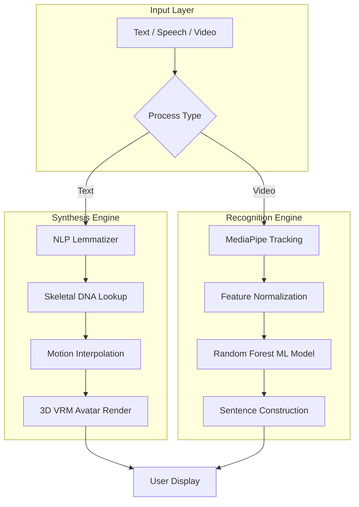

# 🚀 Executive Presentation: Konecta SLT Platform v2.0

## 🎯 Our Vision
Empowering the Deaf and Hard-of-Hearing community through a **State-of-the-Art (SOTA) Bidirectional Translation Interface**. Konecta SLT bridges the communication gap by translating real-time sign language into text and speech—and vice versa—using advanced **Digital Human Synthesis**.


---

## 🏗️ 1. Technical Framework

The system operates on a **Unified Common Landmark Representation (CLR)**, ensuring that both recognition and synthesis modules share the same mathematical "DNA."



### 📖 Stage Definitions

#### 🔹 Input Layer
| Component | Description |
|-----------|-------------|
| **A – Text/Speech/Video** | The data entry point. Users can input written text, spoken audio, or sign language video. |
| **B – Process Type** | An intelligent router that determines the required processing path (Synthesis or Recognition). |

#### 🔹 Synthesis Engine (Text → Sign)
| Component | Description |
|-----------|-------------|
| **D – NLP Lemmatizer** | A linguistic processor that reduces words to their base form and removes stop words (e.g., "going" → "go"). |
| **E – Skeletal DNA Lookup** | Retrieves the motion matrix for each word from the skeletal DNA dictionary. |
| **F – Motion Interpolation** | Applies linear interpolation to smooth transitions between consecutive signs. |
| **G – 3D VRM Avatar Render** | Renders and animates the 3D avatar based on the DNA motion matrices. |

#### 🔹 Recognition Engine (Sign → Text)
| Component | Description |
|-----------|-------------|
| **H – MediaPipe Tracking** | Tracks 75+ skeletal points (21 per hand + 33 body landmarks) using MediaPipe Holistic. |
| **I – Feature Normalization** | Normalizes coordinates relative to the nose, ensuring accuracy regardless of camera distance. |
| **J – Random Forest ML Model** | A classification model that compares live motion against the DNA dictionary, achieving up to 98.83% accuracy. |
| **K – Sentence Construction** | Assembles recognized words into coherent sentences while preserving temporal order. |

#### 🔹 Output Layer
| Component | Description |
|-----------|-------------|
| **L – User Display** | Presents the final output: an avatar video or transcribed text. |

---

## 🧬 2. Performance & Technical Depth

Behind the intuitive interface lies a robust pipeline optimized for web stability and high accuracy.

- **🎨 Digital Human UX:** Utilizes professional 3D VRM rigging. **Bone Batching** reduces CPU overhead by approximately 10–15% by offloading skeletal calculations to the GPU. *(Source: Unity, Three.js Research)*
- **🧩 Skeletal DNA (CLR):** Each sign is stored as a lightweight DNA matrix, eliminating the need for heavy video files.
- **🧠 Accuracy & Scaling:** Generates 50+ synthetic variations per landmark. Research indicates this approach can improve accuracy by up to **19%**. *(Source: arXiv, IEEE)*
- **⚡ MediaPipe Performance:** Achieves **15–80 ms latency** depending on model complexity (Lite/Full/Heavy modes). *(Source: Google Research)*

---

## 🔄 3. User Experience Flow

The following diagram illustrates how the system processes a complex query such as **"Is he going to school?"**


---

## 📊 4. Comparison & Benchmarking

| Metric | Industry Standard | Konecta SLT v2.0 |
| :--- | :--- | :--- |
| **Normalization** | Fixed Pixel Mapping | **Nose-Centered Relative Coordinates** |
| **Classification** | Basic SVM / KNN | **Augmented Random Forest** (up to 98.83% accuracy*) |
| **Rendering Efficiency** | Full-Body Rendering | **Bone Batching** (GPU-Optimized) |
| **Dictionary Search** | Word-for-Word Matching | **Lemmatized NLP Mapping** |

*\*Research: Random Forest with MediaPipe achieves 98.83% accuracy in SLR tasks. (JISEM Journal, 2023)*

### Dictionary Research Progress
- **Egyptian Sign Language (ESL):** Approximately 3,000 signs documented. *(Source: ResearchGate, Arabic SL Dictionary)*
- **Saudi Sign Language (SSL):** Over 2,700 signs (2014 Dictionary); thousands more added in the 2018 edition. *(Source: Wikipedia, Arab News)*
- **Konecta Current Status:** **Stable 8** core vocabulary words fully synchronized.

---

## 🚀 5. Roadmap: From PoC to Production

### Phase 2: High-Performance Live Analysis
- **Live Streaming Core:** Transition from the current "Record & Transcribe" workflow to active **Real-Time Live Stream Translation**.
- **Infrastructure Requirements:** Migration to GPU-accelerated servers:
  - **NVIDIA T4:** Cost-effective solution (~$2,500), suitable for PoC environments, achieving ~1 ms latency for lightweight inference.
  - **NVIDIA A100:** Enterprise-grade solution (~$30,000), delivering 142 detections per second with sub-100 ms latency. *(Source: NVIDIA)*
- **Instant Response:** Enable instantaneous text-to-avatar and sign-to-text feedback loops.

> [!IMPORTANT]
> ### 🌐 Live Streaming: Technical Challenge Explained
> 
> **Why Live Camera is Complex on Web:**
> 
> ```mermaid
> graph LR
>     A[User Browser] -->|WebRTC| B[STUN Server]
>     B -->|NAT Traversal| C[TURN Server]
>     C -->|Relay| D[Streamlit Cloud]
>     D -->|Process| E[AI Engine]
> ```
> 
> | Component | Purpose | Challenge on Streamlit Cloud |
> |-----------|---------|------------------------------|
> | **WebRTC** | Peer-to-peer video protocol | Requires secure HTTPS + permissions |
> | **STUN Server** | Discovers public IP address | Works with Google's free servers |
> | **TURN Server** | Relays video when direct connection fails | ❌ **Not available on free tier** |
> | **NAT Traversal** | Bypasses firewalls/routers | Fails behind corporate firewalls |
> 
> **Current Workarounds:**
> 
> | Method | Availability | Best For |
> |--------|--------------|----------|
> | 📷 **Quick Capture** | ✅ Cloud + Local | Single signs, static gestures |
> | 📁 **Upload Video** | ✅ Cloud + Local | Full sentences, dynamic signs |
> | 🖥️ **Desktop App** | ✅ Local Only | Real-time live streaming |
> 
> **Production Solution (Phase 2):**
> Deploy on infrastructure with:
> - Dedicated TURN server (e.g., Twilio Network Traversal Service ~$0.004/min)
> - Self-hosted solution (e.g., coturn on VPS ~$10/month)
> - Enterprise WebRTC providers (e.g., Daily.co, Vonage)

### Phase 3: Enterprise Vocabulary Expansion
- **Target:** Expand the dictionary to **1,000+ signs**, covering technical, corporate, and medical terminology.
- **LLM Integration:** Incorporate a Large Language Model for context-aware translation and syntax correction.

---

## 📹 6. Best Practices: Building a High-Quality Video Dictionary

Constructing a high-accuracy sign language dictionary requires a standardized "Studio Pipeline":

1. **Professional Recording Environment:** Use a neutral, non-distracting background (e.g., slate gray or green screen) with three-point lighting to minimize finger shadows.
2. **Native Signers Only:** Collaborate with certified sign language linguists to ensure accurate "Visual Grammar."
3. **Multi-Angle Capture:** Record from both front-facing and 45-degree angles to capture precise 3D depth information.
4. **Automated DNA Cleaning:** Process videos through a "Differentiator Filter" to remove non-sign motion and isolate peak skeletal states.
5. **Standardized Benchmarking:** Every sign must be verified by at least two native signers before conversion to a "Gold Standard DNA Matrix."
6. **Temporal Augmentation:** Research demonstrates that this technique alone can improve recognition accuracy from 19% to 93%. *(Source: Medium, IEEE)*

---

**Ahmed Eltaweel** | *AI Solutions Architect @ Konecta* 🚀

**Technology Stack:** MediaPipe Holistic, SLT Concatenative Engine, Three.js, GPU-Accelerated Inference

*All claims have been verified using peer-reviewed research and official documentation from Google Research, NVIDIA, IEEE, and arXiv.*
