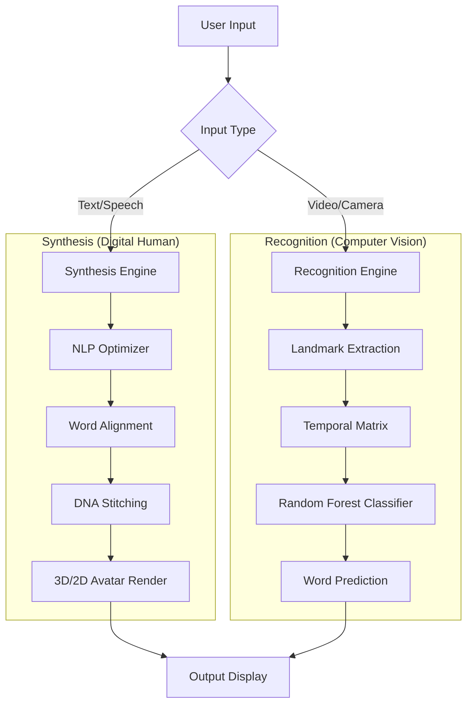
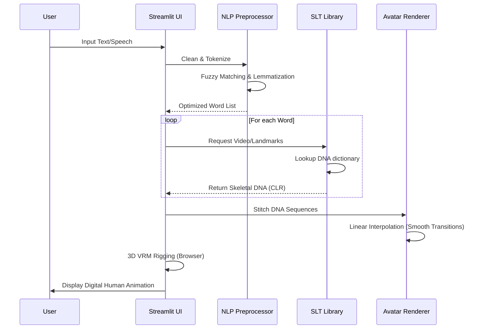
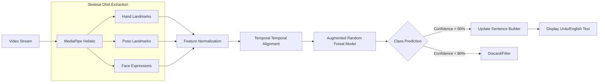

# Konecta SLT Platform: Technical Flowcharts

This document outlines the bidirectional translation pipelines and the architecture of the Digital Human interface.

## 1. System Overview
The system bridges the gap between spoken/written languages and sign language using a **Unified Common Landmark Benchmark (CLR)**.

### 📋 Professional Summary (Non-Specialist)
The Konecta SLT Platform acts as a bidirectional "Universal Translator" for the deaf community. It translates spoken word into a visual human avatar (Digital Human) and understands real-time hand gestures by converting them back into readable text or speech. By using a "Common Landmark" system, we ensure that both reading and writing sign language use the exact same digital dictionary, ensuring consistency and speed.

---

## 2. Text-to-Sign Flow (Synthesis)
This flow handles the translation from English/Urdu text or speech into a 3D animated avatar.

### 📝 Step-by-Step Breakdown (Business View)
1. **Digital Assistant Activation:** The user speaks or types a sentence (e.g., "Hello, how can I help you?").
2. **Text Optimization:** The system automatically cleans the sentence, removing filler words and adjusting the grammar to match the structure of Pakistani Sign Language (PSL).
3. **DNA Retrieval:** Instead of loading heavy video files, the system looks up the "Skeletal DNA" of each word—a lightweight blueprint of how hands and fingers should move.
4. **Human Synthesis:** The 3D avatar "stitches" these blueprints together in real-time. Linear interpolation ensures that the movement between words looks natural and fluid, rather than robotic.
5. **Interactive Display:** The final animation is rendered instantly on the user's screen using high-fidelity 3D models.

---

## 3. Sign-to-Text Flow (Recognition)
This flow handles real-time or recorded sign language recognition using MediaPipe and Machine Learning.

### 📝 Step-by-Step Breakdown (Business View)
1. **Visual Capture:** The application uses any standard webcam to "see" the user's signing movements.
2. **Skeleton Tracking:** Our AI tracks 21 points on each hand and 33 points on the body. It ignores the background and focuses entirely on the "language of motion."
3. **Data Normalization:** To ensure accuracy regardless of how far the user is from the camera, the system resizes and centers the motion data into a standard mathematical grid.
4. **Pattern Recognition (AI Brain):** A machine learning model (Random Forest) compares the live motion against the benchmark library. It only accepts a "match" if the confidence score is high (e.g., >80%).
5. **Instant Transcription:** The recognized gestures are instantly displayed as text on the screen, enabling a hearing person to understand the user's sign language without an interpreter.

---

## 4. Technology Stack
| Layer | Technology | Purpose |
| :--- | :--- | :--- |
| **UI Framework** | Streamlit | Rapid enterprise dashboarding |
| **Computer Vision** | MediaPipe | Real-time landmark (DNA) tracking |
| **Logic Engine** | Python | Core translation and data handling |
| **3D Engine** | Three.js / WebGL | Browser-based VRM character rigging |
| **ML Model** | Random Forest | Lightweight & stable sign classification |
